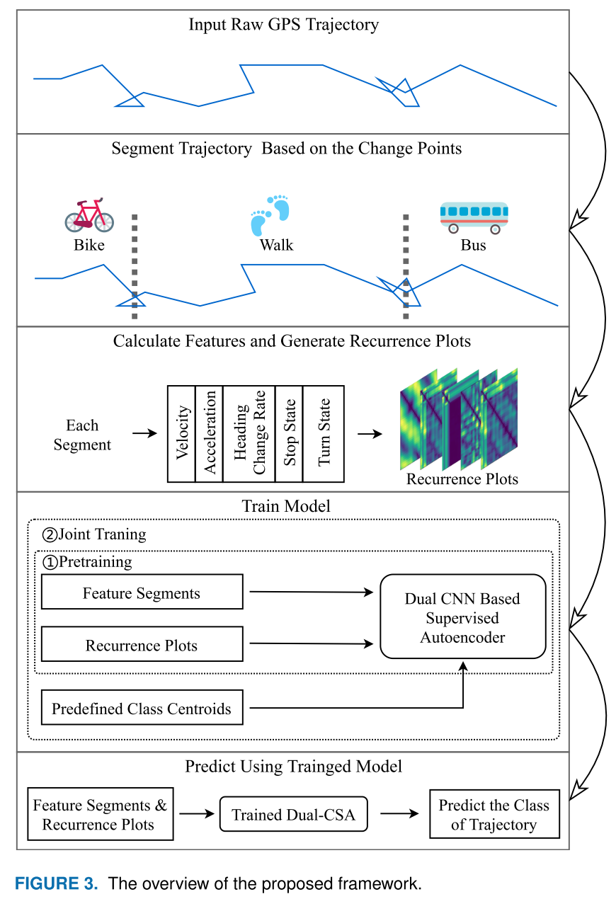

# Trajectory Classification Using Dual-CSA
This project is the code of the paper _Dual Supervised Autoencoder Based Trajectory Classification Using Enhanced Spatio-Temporal Information_  
The paper is available at: https://ieeexplore.ieee.org/document/9204708/

## Abstract
With the rapid development of mobile internet and location awareness techniques, massive spatio-temporal data is collected every day. Trajectory classification is critically important to many
real-world applications such as human mobility understanding, urban planning, and intelligent transportation systems. A growing number of studies took advantage of the deep learning method to learn the
high-level features of trajectory data for accurate estimation. However, some of these studies didn’t interpret
spatio-temporal information well, more importantly, they didn’t fully utilize the high-level features extracted
by neural networks. To overcome these drawbacks, this paper utilizes the proposed stop state and turn state
to enhance spatial information, and at the same time, extracts stronger time information via Recurrence Plot
(RP). Moreover, a novel Dual Convolutional neural networks based Supervised Autoencoder (Dual-CSA)
is proposed by making the network aware of Predefined Class Centroids (PCC). Experiments conducted
on two real-world datasets demonstrate that Dual-CSA can learn the high-level features well. The highest
accuracy of the Geolife and SHL datasets are 89.475% and 89.602%, respectively, proving the superiority
of our method.

## Framework Overview


## Highlights of The Code ✨
- Complete code support from preprocessing to results visualization. In particular, the preprocessing code is easy to migrate to other dataset.
- Most of the code is commented with detail explanation.
- The preprocessing support multi-process to speed up running time.
- The large data such as recurrence plots are generated in hard disk using Pytables, rather than RAM, which saves a lot of memory.
- The training support single GPU, multi-GPUs, multi-Nodes, and CPU.
- All the experiments in tha paper can be run using the shell scripts we wrote.

##  Requirements
- Install PyTorch ([pytorch.org](http://pytorch.org))
- `pip install -r requirements.txt`
- Download Geolife dataset at: https://www.microsoft.com/en-us/research/project/geolife-buildingsocial-networks-using-human-location-history/#!downloads, then put all user folders under `Geolife Trajectories 1.3-Raw-All/Geolife Trajectories 1.3/Data` into our project folder `./data/geolife_raw`
- Download SHL dataset at: http://www.shl-dataset.org/download/, then put all folders under `SHLDataset_User1Hips_v1/release/User1` into our project folder `./data/SHL_raw`

## Project File Structure
- Extracted trajectories and labels from raw dataset & Generated handcrafted features and recurrence plots (RPs) are under `./data`
- Our main Dual-CSA network is under `network_torch/`.
- `network_variant/` includes the variants of our Dual-CSA.
- `ML_comparison/` includes the classical machine learning methods we used to compare.
- `network_comparison/` includes other competitive deep learning based methods, note that they are implemented using keras.
- `exp_scripts/` includes all shell scripts we used to conduct experiments.
- `keras_support_old/` is the implementations of our model using keras, note we will not maintain keras version of our model any more.
- `results/` all training and predict results will be saved at this place.
- `visualization_and_analysis/` includes python code to draw some charts of experimental results in the paper.


# Detail Usage for Each File  
- Before running the code, please set the environment variable of results path in the terminal, for example:  
```
$ results_path=./results/exp1
$ export RES_PATH=${results_path}
```
- Please first run `trajectory_extraction_geolife.py` and `trajectory_extraction_SHL.py` to generate train & test trajectory and label `.npy` file under `./data/*_extracted`.
- `trajectory_segmentation_and_features_extraction.py` is used to segment the trajectory and extract movement features (MFs) and auxiliary features (AFs) for train or test set. For example:  
```
python ./trajectory_segmentation_and_features_extraction.py --trjs_path ./data/geolife_extracted/trjs_train.npy --labels_path ./data/geolife_extracted/labels_train.npy --seg_size 200 --data_type train --save_dir ./data/geolife_features
``` 
where `seg_size` is max number of points in a segment.
- `MF_RP_mat_h5support.py` is used to generate RPs for feature segments generated above. For example: 
 ````
 python ./MF_RP_mat_h5support.py --dim 3 --tau 8 --multi_feature_segs_path ./data/geolife_features/multi_feature_segs_train.npy --save_path ./data/geolife_features/multi_channel_RP_mats_train.h5
````
where `dim` is embedding dimension & `tau` is the time delay in phase space reconstruction.

- `PEDCC.py` is used to generate the predefined evenly-distributed class centroids using the code of paper _A Classification Supervised Auto-Encoder Based on Predefined Evenly-Distributed Class Centroids_. For example:  
```
python ./PEDCC.py --save_dir ./data/geolife_features --dim 304
```
where `dim` is embedding dimension in latent space.
- `network_training.py` is the training code of our model, our network can be trained on GPU, CPU, multi-GPU and multi-Nodes, its detail usage are:  
```
usage: network_training.py [-h] --dataset DATASET [--network NETWORK]
                           [--results-path RESULTS_PATH]
                           [--RP-emb-dim RP_EMB_DIM] [--FS-emb-dim FS_EMB_DIM]
                           [--patience PATIENCE]
                           [--training-strategy TRAINING_STRATEGY]
                           [--no-save-model] [--visualize-emb VISUALIZE_EMB]
                           [--n-features N_FEATURES] [-j N]
                           [--pretrain-epochs N] [--joint-train-epochs N]
                           [-b N] [--wd W] [-p N] [--resume PATH] [-e]
                           [--pretrained] [--world-size WORLD_SIZE]
                           [--rank RANK] [--dist-url DIST_URL]
                           [--dist-backend DIST_BACKEND] [--seed SEED]
                           [--gpu GPU] [--multiprocessing-distributed]

DCSA_Training

optional arguments:
  -h, --help            show this help message and exit
  --dataset DATASET     geolife or SHL
  --network NETWORK     default is Dual_CSA, can be the variants: CSA-RP, CSA-
                        FS, and Dual-CA-Softmax
  --results-path RESULTS_PATH
                        path to save the training and predict results
  --RP-emb-dim RP_EMB_DIM
                        embedding dimension of RP autoencoder in latent space
  --FS-emb-dim FS_EMB_DIM
                        embedding dimension of FS autoencoder in latent space
  --patience PATIENCE   patience of early stop in joint training
  --training-strategy TRAINING_STRATEGY
                        can be: normal_training, normal_only_pretraining,
                        no_pre_joint_training, and only_joint_training
  --no-save-model       this flag will not save model
  --visualize-emb VISUALIZE_EMB
                        this flag will turn on save latent visualization
                        images every visualize_emb epochs
  --n-features N_FEATURES
                        number of MFs and AFs used, default 5
  -j N, --workers N     number of data loading workers (default: 4)
  --pretrain-epochs N   number of pretraining epochs to run
  --joint-train-epochs N
                        number of joint training epochs to run
  -b N, --batch-size N  mini-batch size (default: 256), this is the total
                        batch size of all GPUs on the current node when using
                        Data Parallel or Distributed Data Parallel
  --wd W, --weight-decay W
                        weight decay (default: 1e-4)
  -p N, --print-freq N  print frequency (default: 4)
  --resume PATH         path to latest checkpoint (default: none)
  -e, --evaluate        evaluate model on testation set
  --pretrained          use pre-trained model
  --world-size WORLD_SIZE
                        number of nodes for distributed training
  --rank RANK           node rank for distributed training
  --dist-url DIST_URL   url used to set up distributed training
  --dist-backend DIST_BACKEND
                        distributed backend
  --seed SEED           seed for initializing training.
  --gpu GPU             GPU id to use.
  --multiprocessing-distributed
                        Use multi-processing distributed training to launch N
                        processes per node, which has N GPUs. This is the
                        fastest way to use PyTorch for either single node or
                        multi node data parallel training
```
 Example usage for single nodes, one or multiple GPUs:  
```
python network_training.py --dataset SHL --results-path ./results/exp1  --RP-emb-dim 152 --FS-emb-dim 152 --patience 20 --dist-url tcp://127.0.0.1:6666 --dist-backend nccl --multiprocessing-distributed --world-size 1 --rank 0 -b 230 
```
Example usage for multiple nodes: 
   - Node 0:  
   ```
python network_training.py --dataset SHL --results-path ./results/exp1  --RP-emb-dim 152 --FS-emb-dim 152 --patience 20 --dist-url tcp://127.0.0.1:6666 --dist-backend nccl --multiprocessing-distributed --world-size 2 --rank 0 -b 230
   ```  
    
   - Node 1:  
   ```
python network_training.py --dataset SHL --results-path ./results/exp1  --RP-emb-dim 152 --FS-emb-dim 152 --patience 20 --dist-url tcp://127.0.0.1:6666 --dist-backend nccl --multiprocessing-distributed --world-size 2 --rank 0 -b 230 
   ```
Example usage for CPU (Slow):
```
python network_training.py --dataset SHL --results-path ./results/exp1  --RP-emb-dim 152 --FS-emb-dim 152 --patience 20 -b 230 
```

# Use as a Pipeline Script
This is a shell script run under `exp_scripts`
```
cd ..
dataset='geolife'
results_path=./results/exp
export RES_PATH=${results_path}
python ./trajectory_segmentation_and_features_extraction.py --trjs_path ./data/SHL_extracted/trjs_train.npy --labels_path ./data/SHL_extracted/labels_train.npy --seg_size 200 --data_type train --save_dir ./data/SHL_features
python ./trajectory_segmentation_and_features_extraction.py --trjs_path ./data/SHL_extracted/trjs_test.npy --labels_path ./data/SHL_extracted/labels_test.npy --seg_size 200 --data_type test --save_dir ./data/SHL_features
python ./MF_RP_mat_h5support.py --dim 3 --tau 8 --multi_feature_segs_path ./data/SHL_features/multi_feature_segs_train.npy --save_path ./data/SHL_features/multi_channel_RP_mats_train.h5
python ./MF_RP_mat_h5support.py --dim 3 --tau 8 --multi_feature_segs_path ./data/SHL_features/multi_feature_segs_test.npy --save_path ./data/SHL_features/multi_channel_RP_mats_test.h5
python ./PEDCC.py --save_dir ./data/SHL_features --dim 304
python network_training.py --dataset ${dataset} --results-path ${results_path}  --RP-emb-dim 152 --FS-emb-dim 152 --patience 20 --dist-url tcp://127.0.0.1:6666 --dist-backend nccl --multiprocessing-distributed --world-size 1 --rank 0 -b 230
```
#### Feel free to post issues if you have any questions. (English and Chinese 中文)